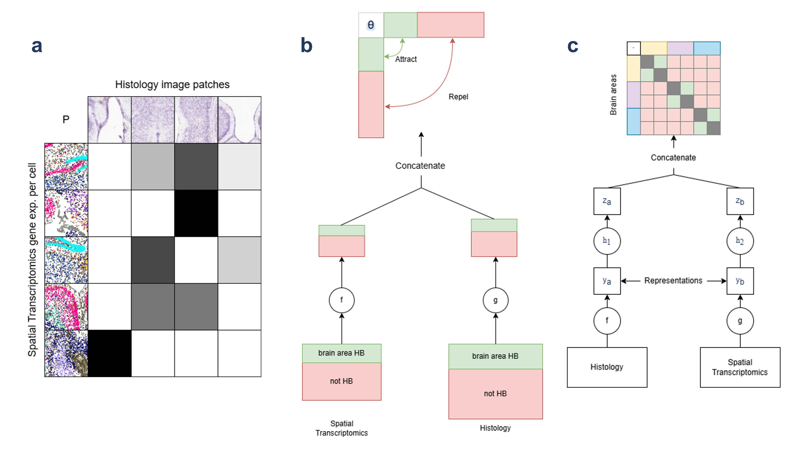

## Cross-modality representation learning on transcriptomics and histology data from the mouse brain
### Repository accompanying the Fortgeschrittenes Praktikum at Spitzer Lab

Exploring different representation learning-based methods for registration of mouse brain ST samples into the CCF of the Allen Mouse Brain Atlas. Two main methods were used, 
Optimal Transport and Contrastive Learning. Generally, all code to run models is in python scripts within respective subfolders. The bash script and "outs"/"errs" folders 
are used to run on slurm. Python 3.10.4 was used for all virtual enviroments.

### Optimal Transport (/ot)
The notebooks are mostly for following the tutorial from MOSCOT and for plotting. In *sample_size.ipynb* I implemented the feature-wise translation to avoid OOM. In 
*location_interpolation.ipynb* I tried out different strategies for CCF prediction, including RANSAC. In *baselines.ipynb* I implemented the random baselines for 
CCF-prediction comparison. In *preprocessing.ipynb*, I did some further Histology processing and the extra features.  
#### /run_ot
Solve and translate and plot UMAPS plus other results. Command line options are described in the help.
#### /solve and /translate
Independently solve or translate the OT.
#### /tune_params
Use hyperparameter tuning on OT. Will randomly subsample the data to enable solving in one GPU.

### Histo (/histo)
Only used for making embeddings from histology embeddings with UNI. 

### Contrastive learning (/cl)
The notebook *train_val_test_split.ipynb* was used to create the dataset splits, in *evaluate.ipynb* all the result plots were created.
#### /simple_model
Contains all the code for models and dataloading. This is not executable but used in the respective *run* scripts. 
#### /run_simclr
Run the first model architecture based on the InfoNCE loss.
#### /run_supcon
Run the second architecture based on the SupCon loss.
